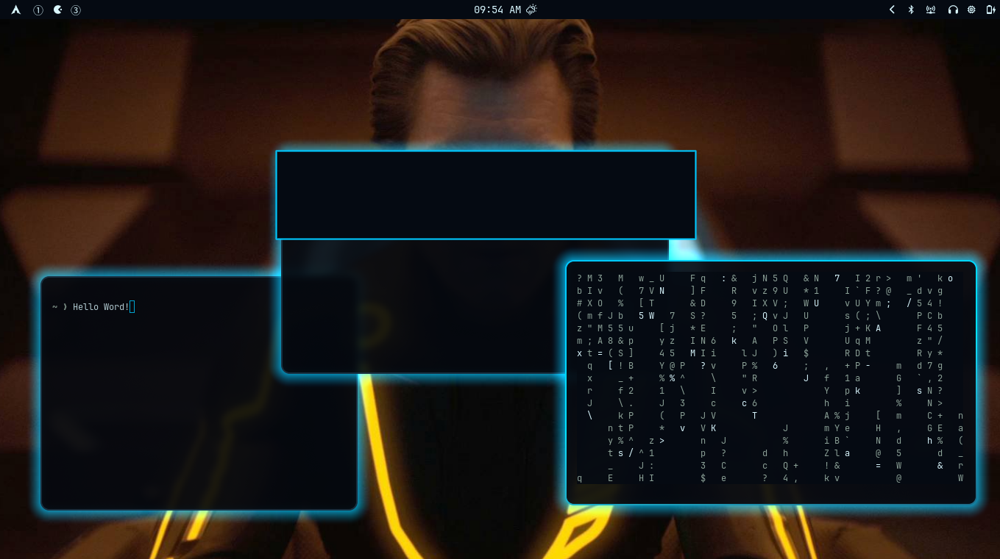
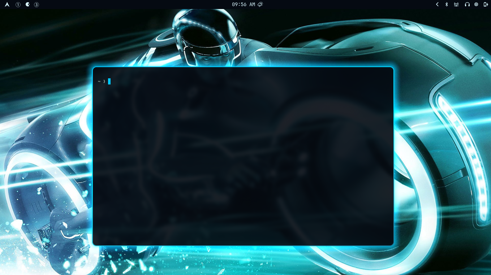
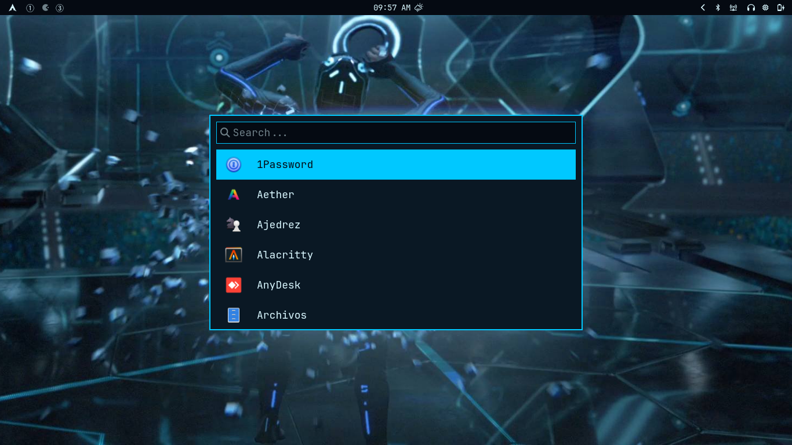

# TRON: Legacy — Omarchy theme

Tema independiente para Omarchy inspirado en **TRON: Legacy**: fondo negro
azulado, cian eléctrico, bordes con degradado y sombra luminosa tipo Grid.

## Instalación local

Desde este repositorio:

```bash
omarchy theme install /home/cipriano/git/omarchy-tron-legacy-theme
omarchy theme set tron-legacy
```

También puedes enlazarlo para desarrollarlo:

```bash
ln -sfn "$PWD" ~/.config/omarchy/themes/tron-legacy
omarchy theme set tron-legacy
```

## Fondos

La carpeta incluye 10 fondos de TRON: Legacy en JPG/PNG, además de
`backgrounds/grid.svg`, un fondo original inspirado en la estética de la
película. Después de instalar el tema, usa:

```bash
omarchy theme bg next
```

Las fuentes y las condiciones de uso están documentadas en
`backgrounds/SOURCES.txt`. Son archivos descargados para uso personal local;
no redistribuyas las imágenes sin permiso.

## Capturas

Estas capturas muestran el tema aplicado en el escritorio, terminal, Walker y
notificaciones. Se eliminaron datos de red e identidad antes de publicarlas.








La captura de Chromium se conserva fuera del repositorio hasta corregir su
color y retirar los accesos personales visibles.

## Paleta

- Fondo Grid: `#050A12`
- Cian principal: `#00C8FF`
- Cian brillante: `#00E5FF`
- Texto frío: `#D9F7FF`
- Azul apagado: `#122738`

## Licencia

MIT para las configuraciones originales de este repositorio. TRON y TRON:
Legacy son marcas y obras de sus respectivos titulares.
